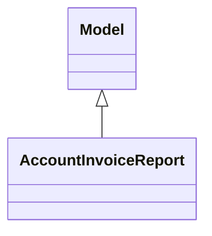

# Reports

Report definitions and templates in l10n_ar.

## Available Reports

### Analytical/Dashboard Reports
- **IIBB - Purchases by jurisdiction** (Analysis/Dashboard)
- **IIBB - Sales by jurisdiction** (Analysis/Dashboard)

## Report Files

- **__init__.py** (Python logic)
- **invoice_report.py** (Python logic)
- **invoice_report_view.xml** (XML template/definition)

## Notes
- Named reports above are accessible through Odoo's reporting menu
- Python files define report logic and data processing
- XML files contain report templates, definitions, and formatting
- Reports are integrated with Odoo's printing and email systems
